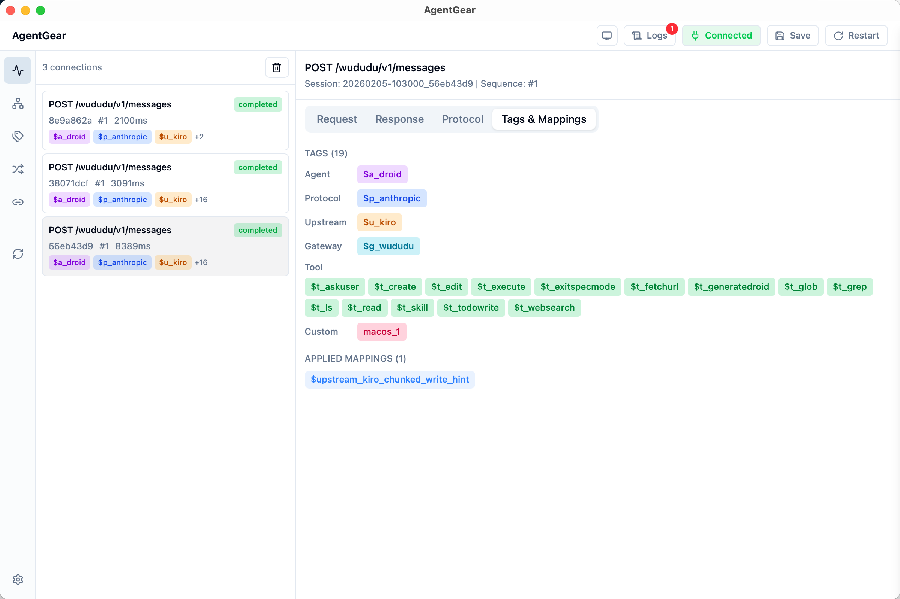
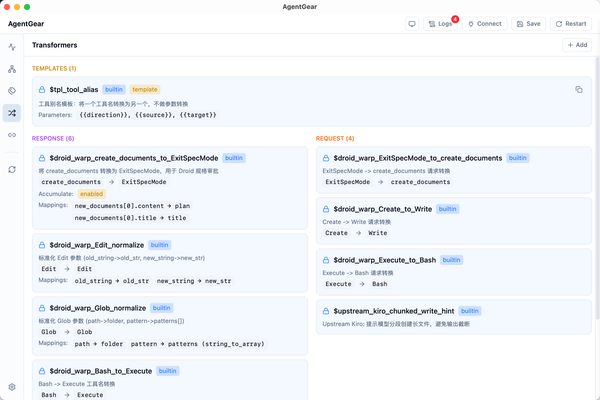
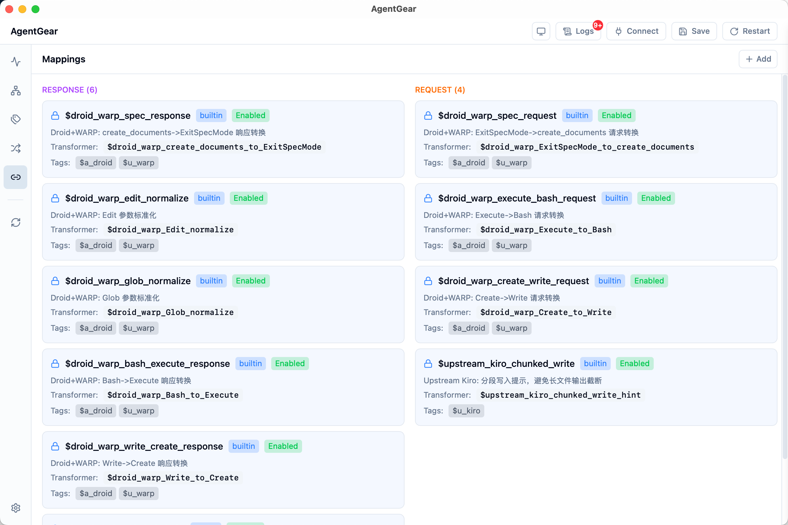

# AgentGear

AgentGear 是一个基于 Go 语言实现的 Agent API 适配层，用于解决不同 Agent 上下游之间的协议兼容性问题。

## 背景

当本地 Agent（如 Droid）调用远程 API（如通过 Warp 反向代理的 Anthropic API）时，可能会遇到以下问题：

- 远程 API 返回本地 Agent 不支持的工具调用
- 协议格式存在差异
- 需要记录请求/响应进行问题分析

AgentGear 作为中间代理层，提供：

1. **透明代理** - 转发 API 请求到上游 (端口 9000)
2. **内部 API** - 管理和监控接口 (端口 9001)
3. **内存存储** - 连接信息存储，支持实时查看
4. **标签系统** - 根据请求特征自动打标签
5. **工具转换** - 基于标签的配置化转换
6. **流式支持** - SSE 流式响应处理和转换
7. **Thinking 保留** - 自动缓存并补全被 Agent 丢弃的 thinking blocks，防止上游 400 错误

## 项目结构

```
agentgear/
├── proxy/                         # Go CLI 代理模块 (独立可部署)
│   ├── cmd/agentgear/             # 入口
│   ├── internal/                  # 内部实现
│   ├── configs/                   # 配置文件
│   ├── Dockerfile
│   └── go.mod
├── gui/                           # 图形界面模块 (Tauri + React)
├── docs/                          # 文档
└── docker-compose.yaml
```

## 快速开始

### 安装

```bash
cd proxy
go build -o agentgear ./cmd/agentgear/
```

### 配置

创建 `configs/config.yaml`（可参考 `configs/config.example.yaml`）：

```yaml
server:
  port: 9000              # 代理端口
  host: "0.0.0.0"
  api_port: 9001          # 内部 API 端口
  api_host: "0.0.0.0"

gateways:
  - name: "anthropic"
    path: "/v1"
    upstream: "https://api.anthropic.com"
    timeout: 300
    enabled: true

  # DeepSeek API (Anthropic-compatible, supports extended thinking)
  # - name: "deepseek"
  #   path: "/deepseek"
  #   upstream: "https://api.deepseek.com"
  #   timeout: 600
  #   enabled: true

logging:
  enabled: false
  dir: "./logs"
  max_size: 100
  max_backups: 10
  max_age: 30

memory:
  max_connections: 1000
  retention_minutes: 60
```

### 运行

```bash
./agentgear
# 或指定配置文件
./agentgear -config /path/to/config.yaml
```

### 使用

将本地 Agent 的 API 地址指向 AgentGear：

```bash
export ANTHROPIC_BASE_URL="http://127.0.0.1:9000/v1"
```

## 架构

```
┌─────────────┐     ┌─────────────────────────────────┐     ┌─────────────┐
│  Local      │     │  AgentGear Proxy (9000)         │     │  Upstream   │
│  Agent      │────▶│  ┌─────────┐ ┌───────────────┐  │────▶│  API        │
│  (Droid)    │◀────│  │ Tagging │ │ Transformer   │  │◀────│  (Anthropic)│
└─────────────┘     │  └─────────┘ └───────────────┘  │     └─────────────┘
                    │  ┌─────────┐ ┌───────────────┐  │
                    │  │ Memory  │ │ API (9001)    │  │
                    │  │ Store   │ │ + WebSocket   │  │
                    │  └─────────┘ └───────────────┘  │
                    └─────────────────────────────────┘
                                    │
                                    ▼
                    ┌─────────────────────────────────┐
                    │  GUI (Tauri + React)            │
                    │  - 连接监控                      │
                    │  - 转换器管理                    │
                    │  - 标签规则配置                  │
                    └─────────────────────────────────┘
```

## 截图预览

### 连接监控


### 转换器管理


### 映射规则


## API 端点

### 代理端口 (9000)

| 端点 | 说明 |
|------|------|
| `GET /health` | 健康检查 |
| `ANY /{gateway_path}/*` | 代理转发到对应网关的上游 |

### 内部 API 端口 (9001)

| 端点 | 说明 |
|------|------|
| `GET /api/health` | 健康检查 |
| `GET /api/stats` | 统计信息 |
| `GET /api/connections` | 连接列表 |
| `GET /api/connections/:id` | 连接详情 |
| `DELETE /api/connections` | 清空连接 |
| `GET /api/tags` | 标签统计 |
| `GET /api/tagging/rules` | 标签规则列表 |
| `PUT /api/tagging/rules/:name` | 更新标签规则 |
| `DELETE /api/tagging/rules/:name` | 删除标签规则 |
| `POST /api/tagging/test` | 测试标签匹配 |
| `GET /api/transformers/defs` | 转换器定义列表 |
| `POST /api/transformers/defs` | 创建转换器定义 |
| `PUT /api/transformers/defs/:name` | 更新转换器定义 |
| `DELETE /api/transformers/defs/:name` | 删除转换器定义 |
| `GET /api/mappings` | 映射规则列表 |
| `POST /api/mappings` | 创建映射规则 |
| `PUT /api/mappings/:name` | 更新映射规则 |
| `DELETE /api/mappings/:name` | 删除映射规则 |
| `GET /api/gateways` | 网关列表 |
| `POST /api/gateways` | 创建网关 |
| `PUT /api/gateways/:name` | 更新网关 |
| `DELETE /api/gateways/:name` | 删除网关 |
| `POST /api/config/save` | 保存配置到文件 |
| `WS /api/ws` | WebSocket 实时推送 |

## License

MIT
